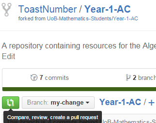

How to use Git
==============

What is Git?
------------
What happens when you are working on a project, but you want to make regular backups in case you need to recover a past version of the project? Maybe you save all the files into a folder called `My-Project-Backup-1`, then `My-Project-Backup-2` and so on. This can become tedious, and isn't much help if you are trying to find a specific version of your project where you changed a particular feature.

Also, what happens if you want to collaborate on a project? Do you change some features, then send them your edited version over email, and vice-versa? What happens if your collaborator edits the same file as you? Do you just copy and paste their changes into your files? 

**The solution is git**.

*Git* allows you to make changes to files, and then take a snapshot of the project's current state while adding a caption for its current state, such as "Changed introduction of research section".

Git solves the mentioned problems:

1. If you make a mistake, or need to see a previous version, you can look through your previous snapshots (usually known as 'commits') and find the relevant caption/commit message, and then look at the files there.
2. Collaborating on projects is made easy, since Git figures out what has been changed, and then tries to merge these changes automatically. If there are any clashes, Git will ask you to fix these manually, but usually there are no problems.

How to Contribute (Basic Method)
--------------------------------
1. [Create a GitHub account](https://github.com/join).
2. Make your changes to the files.
	* If you wish to change the content of a file, click on the file, then click the edit button at the top right of the file.
	
	* If you wish to add a file, click the `+` button.
	
3. Once you are finished, click the `Propose file change`/`Propose new file` button.
4. On the next page, click the `Create pull request` button.
5. Finally, click the `Create pull request` button on the next page.
6. Your changes will be reviewed and published.
7. Repeat from step 2 for any files you wish to change.

###Exercise
Try adding your name on a new line to `Names.txt` and submit a pull request.

How to use Git (Advanced)
-------------------------

###First Time
1. Install Git [here](https://git-scm.com/downloads).
2. Configure the global settings.
	* `git config --global user.name "YOUR NAME"`
	* `git config --global user.email "YOUR EMAIL"`
3. [Create a GitHub account](https://github.com/join).
4. Fork the repository you wish to edit by clicking the `Fork` button at the top right of the repository page.
   
5. Clone your fork: 
   `git clone https://github.com/YOUR_USERNAME/REPO_NAME`
6. At the original repo as an remote: 
   `git remote add upstream https://github.com/ORIGINAL_OWNER/ORIGINAL_REPO.git`
7. Create a new branch for your changes: 
   `git checkout -b my-changes master`
8. Make your changes to the files.
9. Commit your changes.
	* `git add --all`
	* `git commit -m "SUMMARY OF CHANGES HERE"`
10. Push the changes to your remote fork.
   `git push -u origin my-changes`
11. Submit a pull request on GitHub by selecting the `my-changes` branch on your fork. Follow the instructions to complete the pull request.

   

	
###Other Times
In future times, you will need to make sure that your `master` branch is up-to-date with the original master branch, since others might have edited it. Then, any changes that have been made by others can be seen on your machine.

1. `git checkout master`
2. `git fetch upstream`
3. `git rebase upstream/master`
4. `git rebase master`

If the step 4 does not work, this means there has been some conflict in syncing the public changes with your changes. Follow the instructions in the terminal to figure out which files you need to edit in order to make this step complete.

Help
----
If you need any help, email [UoBMathsGithub@googlemail.com](mailto:UoBMathsGithub@googlemail.com)

